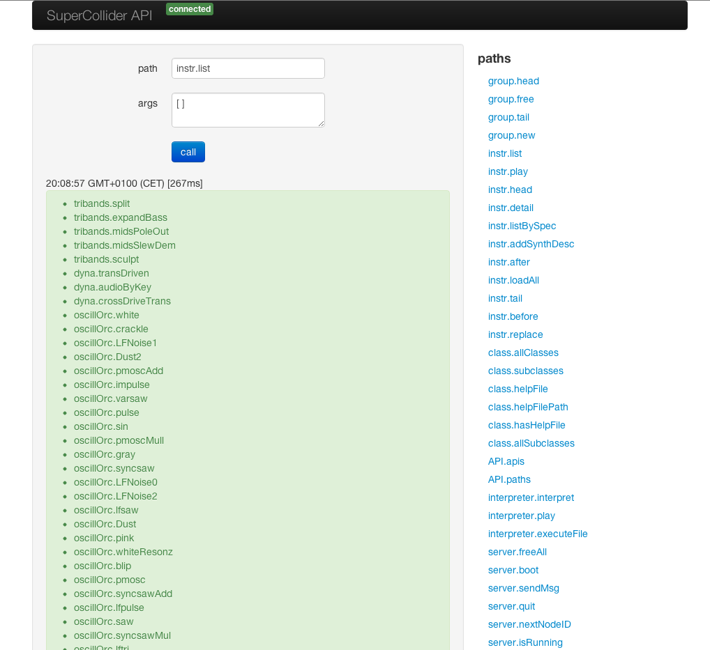

bin/scapi
=========

This launches a webserver with websockets enabled that serves as a bridge to the API quark running in SuperCollider.

* webpage javascript (websockets)-> webserver
* webserver (OSC)-> API quark on sclang

https://github.com/crucialfelix/API

Usage::

  scapi [options]

Options::

    -h, --help        output usage information
    -V, --version     output the version number
    --config <path>   Configuration file eg. .supercollider.yaml
    -p --port <port>  Port to run local webserver on [default=4040]

Setup
-----

In SuperCollider::

  Quarks.install("API");
  // Activate the OSC responders
  API.mountDuplexOSC;

Experiment with the APIs
------------------------

Called without any arguments it serves a test page for experimenting with API::

    scapi

open http://localhost:4040/

Launch a webserver
------------------

Given a directory path it will serve that as webroot::

  # serve current directory
  scapi ./

Create an index.html any other images, css, sub folders you want

in your index.html::

    // the webserver has routes defined to serve these:
    
    
    
